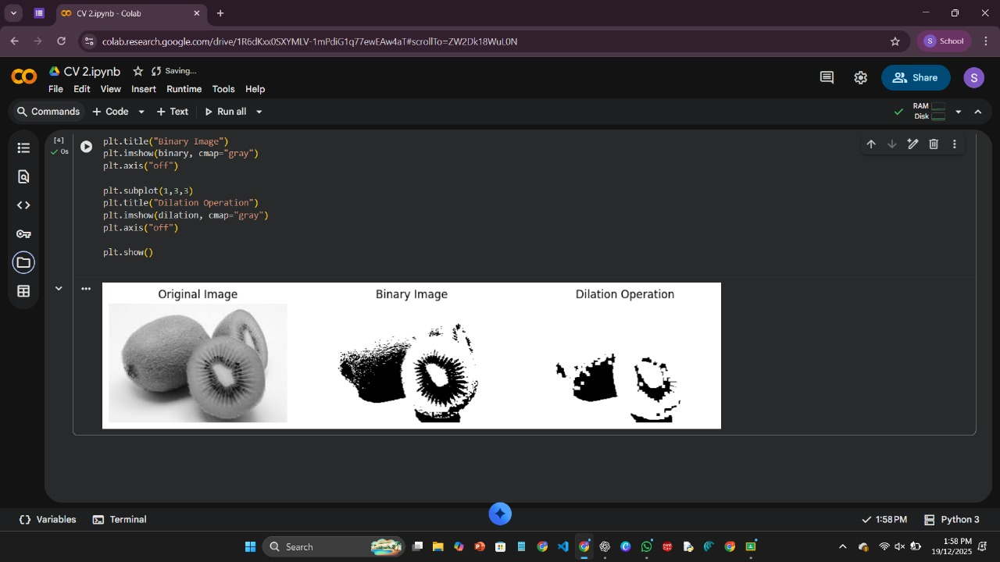

import cv2
from google.colab.patches import cv2_imshow
# Read the image
image = cv2.imread("/content/cda.jpg")
# Apply Gaussian Blur
# (5,5) is the kernel size and 0 is the standard deviation
blurred_image = cv2.GaussianBlur(image, (5, 5), 0)
cv2_imshow(image)
cv2_imshow(blurred_image)
cv2.imwrite("gaussian_blur.jpg", blurred_image)

 
 ## Output

### Gaussian Blurred Image

